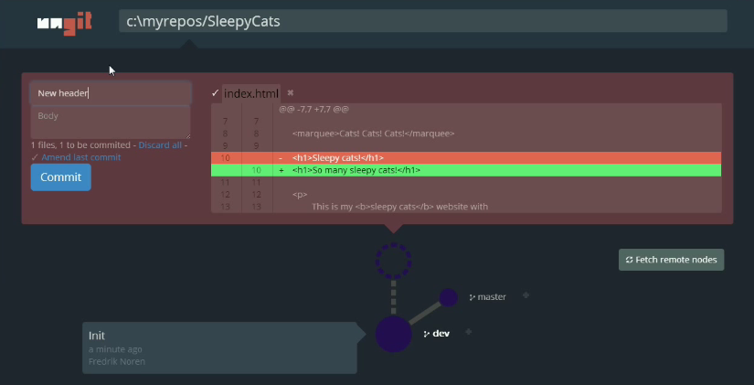

ungit
======
[](http://badge.fury.io/js/ungit)
[](https://travis-ci.org/FredrikNoren/ungit)

The easiest way to use git. On any platform. Anywhere.

 * Clean and intuitive UI that makes it easy to _understand_ git.
 * Runs on any platform that node.js & git supports.
 * Web-based, meaning you can run it on your cloud/pure shell machine and use the ui from your browser (just browse to http://your-cloud-machine.com:8448).
 * Works well with GitHub.
 * [Gerrit](https://code.google.com/p/gerrit/) integration through plugin: https://github.com/FredrikNoren/ungit-gerrit

[Follow @ungitui on twitter](https://twitter.com/ungitui)

Quick intro to ungit: [http://youtu.be/hkBVAi3oKvo](http://youtu.be/hkBVAi3oKvo)

[](http://youtu.be/hkBVAi3oKvo)

Installing
----------
Requires [node.js](http://nodejs.org) (≥ 0.10), [npm](https://npmjs.org/) (≥ 1.3.1, comes with node.js) and [git](http://git-scm.com/) (≥ 1.8.x). To install ungit just type:

	npm install -g ungit

NOTE: If your system requires root access to install global npm packages, make sure you use the -H flag:

	sudo -H npm install -g ungit

Using
-----
Anywhere you want to start, just type:

	ungit

This will launch the server and open up a browser with the ui.

Configuring
---------
Put a configuration file called .ungitrc in your home directory (`/home/USERNAME` on *nix, `C:/Users/USERNAME/` on windows). Can be in either json or ini format. See source/config.js for available options.

You can also override configuration variables at launch by specifying them as command line arguments; `ungit --port=8080`. To disable boolean features use --no: `ungit --no-autoFetch`.

Example of `~/.ungitrc` configuration file to change default port and enable bugtracking:

```json
{
	"port": 8080,
	"bugtracking": true
}
```

Ungit uses [rc](https://github.com/dominictarr/rc) for configuration, which in turn uses [optimist](https://github.com/substack/node-optimist) for command line arguments. See corresponding documentations for more details.

Plugins
-------
Plugins are installed by simply placing them in the Ungit plugin directory (`~/.ungit/plugins` by default), and then restarting Ungit.

[List of available plugins](https://github.com/FredrikNoren/ungit/wiki/List-of-plugins)

There's a guide in the [PLUGINS.md](PLUGINS.md) file on how to write new plugins.

Developing
----------

See [CONTRIBUTING.md](CONTRIBUTING.md).

Known issues
------------

* If you're running MacOSX Mavericks and Ungit crashes after a few seconds; try updating npm and node. See [#259](https://github.com/FredrikNoren/ungit/issues/259) and [#249](https://github.com/FredrikNoren/ungit/issues/249) for details.

License (MIT)
-------------

Copyright (C) 2013-2014 Fredrik Norén

Permission is hereby granted, free of charge, to any person obtaining a copy of this software and associated documentation files (the "Software"), to deal in the Software without restriction, including without limitation the rights to use, copy, modify, merge, publish, distribute, sublicense, and/or sell copies of the Software, and to permit persons to whom the Software is furnished to do so, subject to the following conditions:

The above copyright notice and this permission notice shall be included in all copies or substantial portions of the Software.

THE SOFTWARE IS PROVIDED "AS IS", WITHOUT WARRANTY OF ANY KIND, EXPRESS OR IMPLIED, INCLUDING BUT NOT LIMITED TO THE WARRANTIES OF MERCHANTABILITY, FITNESS FOR A PARTICULAR PURPOSE AND NONINFRINGEMENT. IN NO EVENT SHALL THE AUTHORS OR COPYRIGHT HOLDERS BE LIABLE FOR ANY CLAIM, DAMAGES OR OTHER LIABILITY, WHETHER IN AN ACTION OF CONTRACT, TORT OR OTHERWISE, ARISING FROM, OUT OF OR IN CONNECTION WITH THE SOFTWARE OR THE USE OR OTHER DEALINGS IN THE SOFTWARE.

[](https://david-dm.org/FredrikNoren/ungit)
[](https://david-dm.org/FredrikNoren/ungit#info=devDependencies)
